# TerminologyServerUses
Code snippets and exemplars to demonstrate use cases for the NHS Digital Terminology Server

## FHIRTerminologyConnector
Power Query connector example code that allows Power BI Desktop to connect to the Terminology Server.

### Trying example connector
* Copy the [example connector](./FHIRTerminologyConnector/FHIRTerminologyConnector.mez) into [Documents]/Power BI Desktop/Custom Connectors 
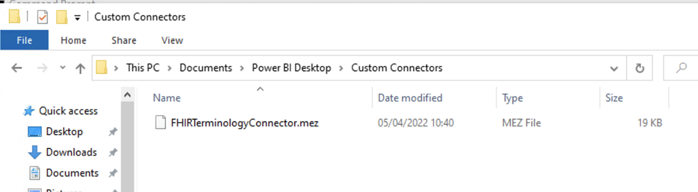
* Follow the [instructions](https://docs.microsoft.com/en-us/power-bi/connect-data/desktop-connector-extensibility) to enable loading of unsigned connectors.
* Restart Power BI Desktop
* Select the option to "Get data from another source -->"
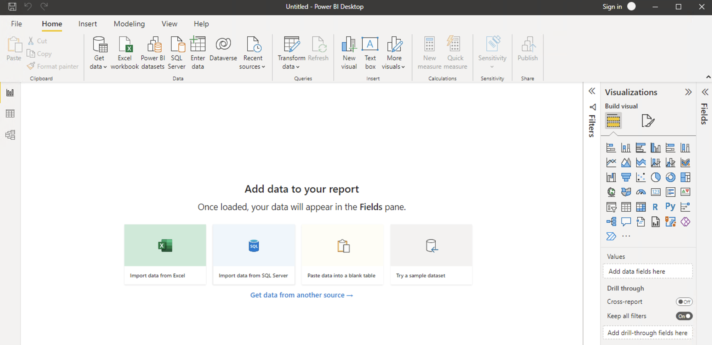
* Select the "FHIRTerminologyConnector (Beta)" and click "Connect" 
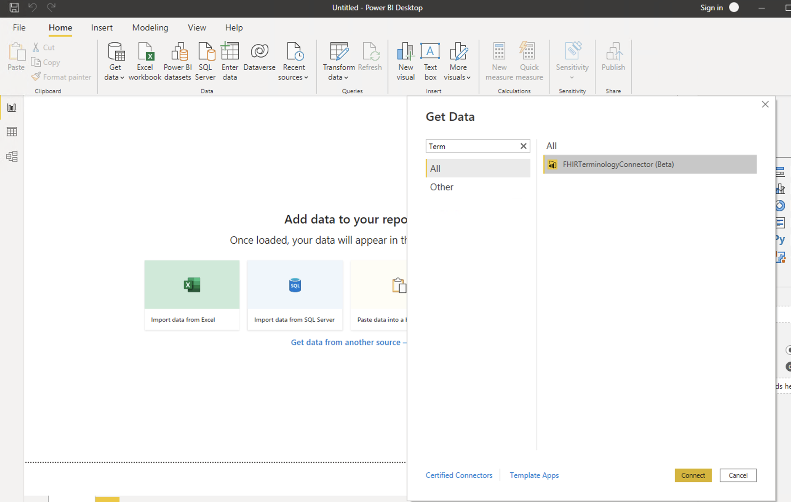
* Provide the terminology server url that retrieves the terminology content you need (e.g. https://ontology.nhs.uk/production1/fhir/ValueSet/$expand?url=http://snomed.info/sct?fhir_vs=refset/723264001) 
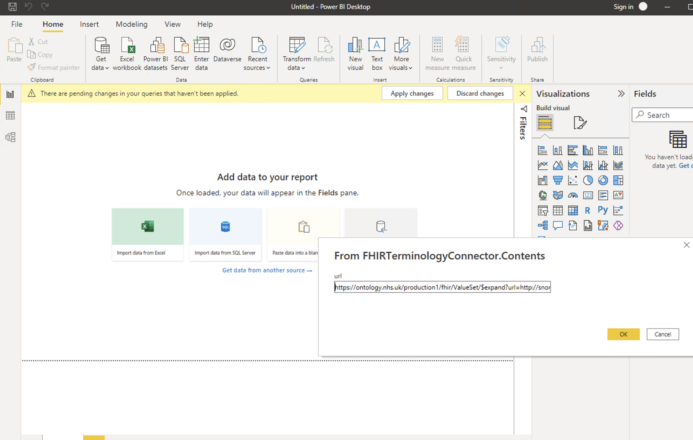
* Sign in using your normal terminology server user credentials 
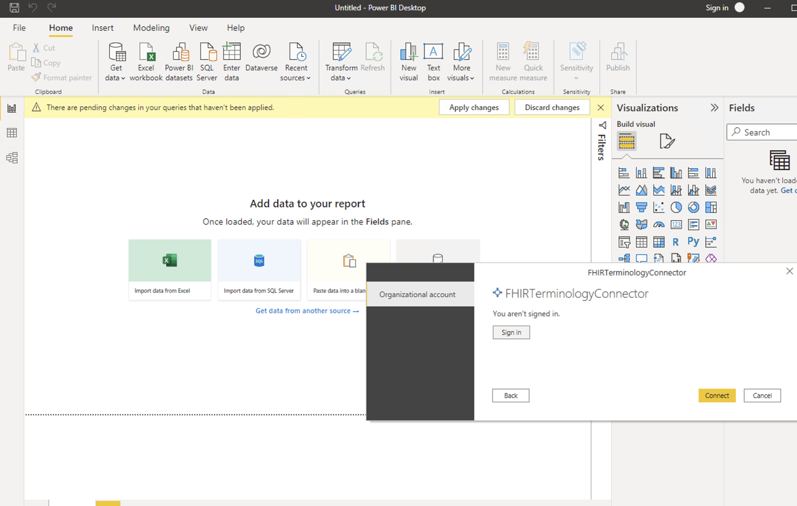
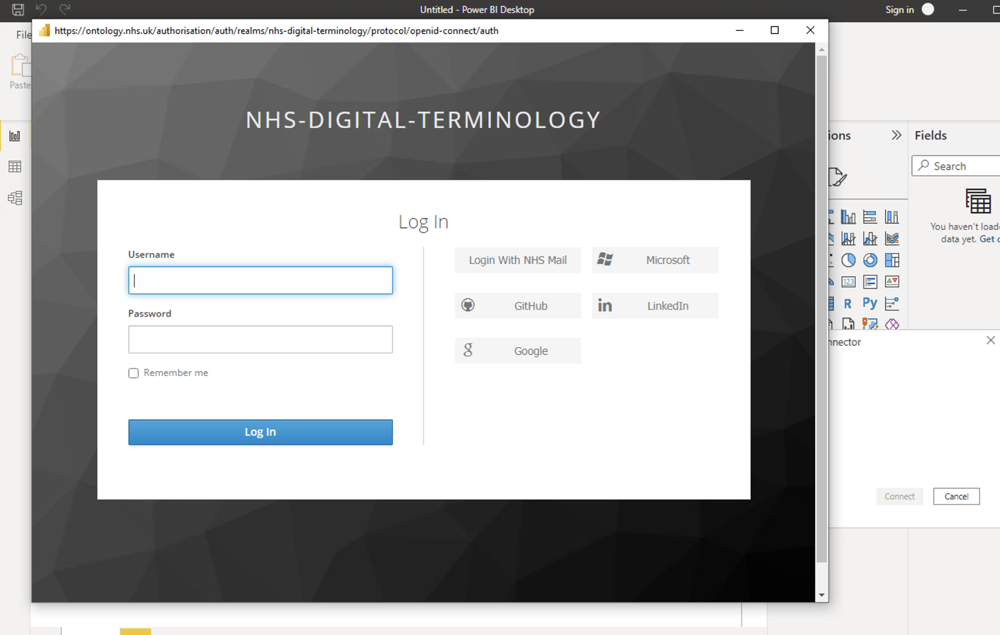
* Then "Connect" 

* Navigate through the json response (e.g. expansion "Record" then contains "List") 
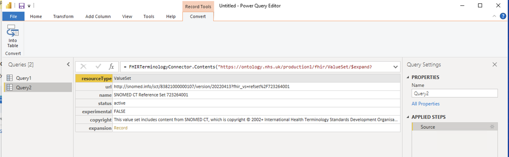
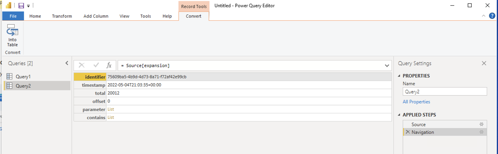
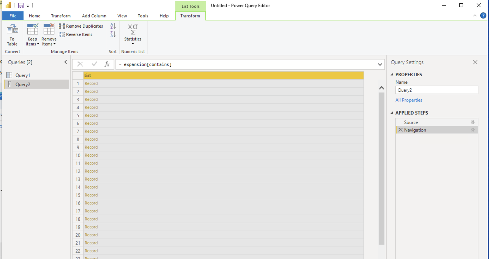
* Convert to table 
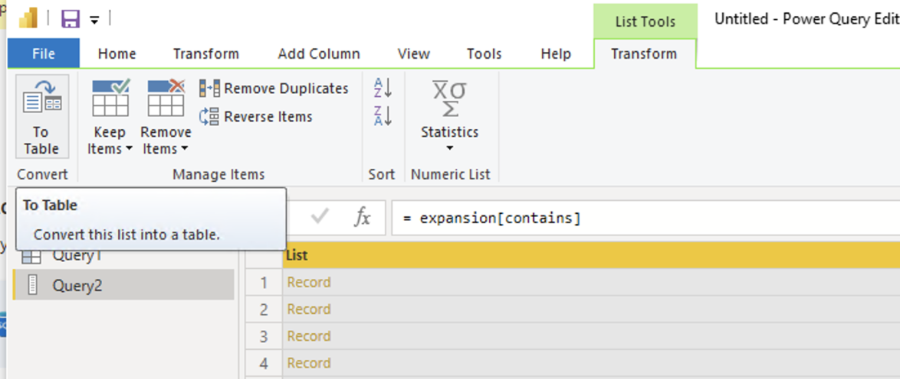
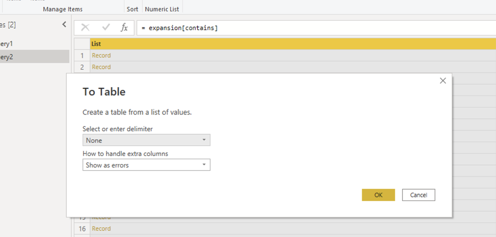
* Show columns 
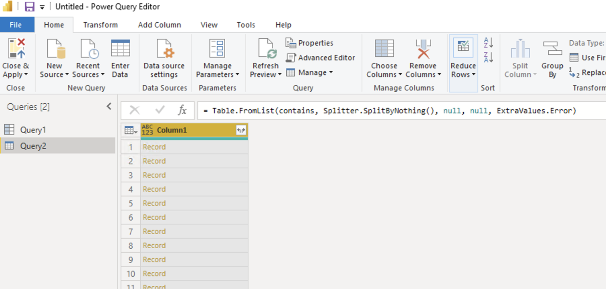
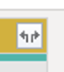
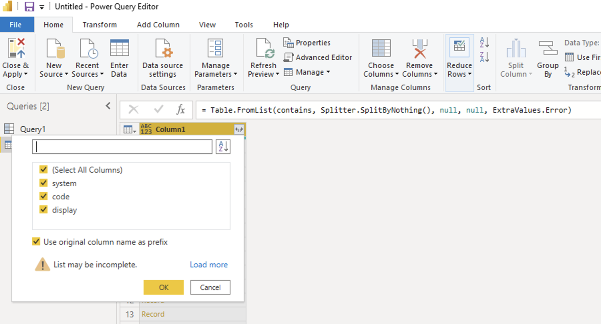
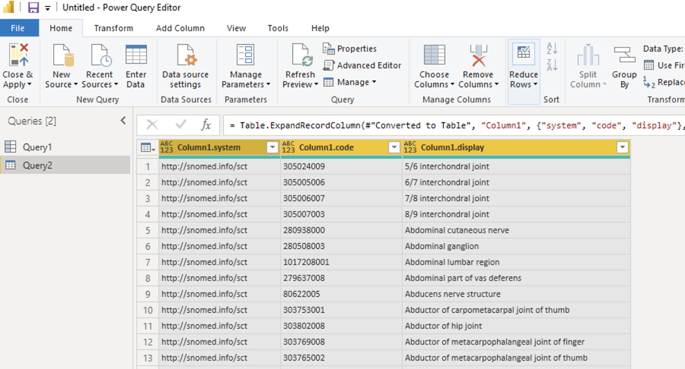
  
### Building example connector
The source code is provided for the example connector if you want to take the example further. Visual Studio and [PowerQuery SDK](https://marketplace.visualstudio.com/items?itemName=Dakahn.PowerQuerySDK) are required to build it (note: at the moment the latest version of Visual Studio that is supported by the PowerQuery SDK is 2019). For build instructions/guidance please see: [Create custom power query connectors](https://docs.microsoft.com/en-us/power-query/startingtodevelopcustomconnectors).

For details on how to sign/certify connectors for safe distribution:

https://docs.microsoft.com/en-us/power-query/connectorcertification

https://docs.microsoft.com/en-us/power-query/handlingconnectorsigning
